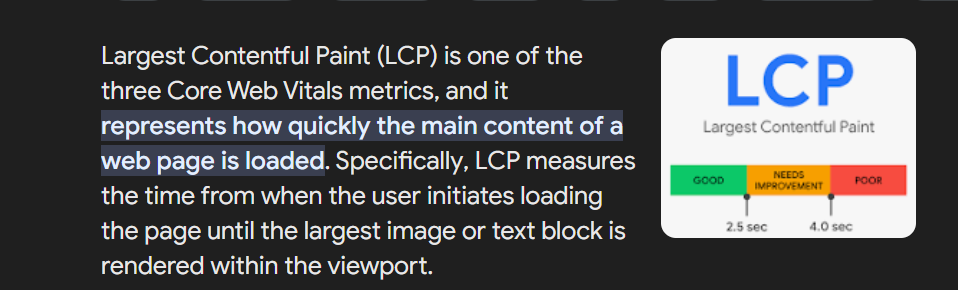

# Intro to the Web Development
## Browser Wars
The war is between Netscape and IE
# 3 layer architecture:
 - FE
   - Angular
   - React 
 - BE
 - DB
   - python
   -java
   -nodes
## selectors

-element selector

-class selector
```css
.red{
    color:red;
}

```
The alt attribute is used for 3 main reasons:
- if the image is not available this attribute description is displayed
- for visually impaired people
- SEO -->Search Engine Optimization



# References
- https://developer.mozilla.org/en-US/docs/Web/HTTP/Status#information_responses
- https://caniuse.com/
- https://squoosh.app/


