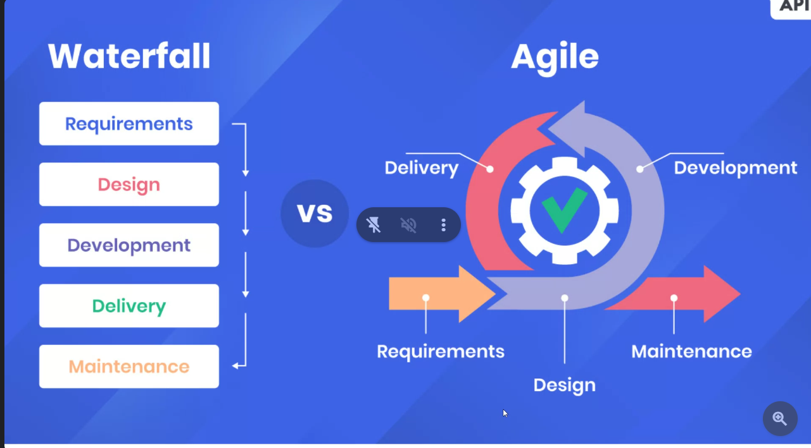

# Intro to the Web Development
## Browser Wars
The war is between Netscape and IE
# 3 layer architecture:
 - FE
   - Angular
   - React 
 - BE
 - DB
   - python
   -java
   -nodes
   ### why 3 layer?
   - loosely coupled - fleaxibility working with diff backend or fronends
   - performance agnostic - 
   - micro service architecture
## selectors

-element selector

-class selector
```css
.red{
    color:red;
}

```
The alt attribute is used for 3 main reasons:
- if the image is not available this attribute description is displayed
- for visually impaired people
- SEO -->Search Engine Optimization


# JavaSCRIPT
The datatypes in this are:
- number
- boolean
- object
- string
- To declare a variable we use let, var, and const keywords

Redeclartion: delclaring the variable again
Reassignment: Assigning or modifying new value to the variable
when declairng an array as const, we cannot change the array, as the address cannot be changed but the values can be changed.

# SCOPE
It is the lifetime of the variable. 
Variables declared with the var keyword can NOT have block scope. It is because the life time of the varible is done.
## undefined vs not defined
undefined is the value.
not defined is the error.

```js var x1=3;
var x2="5";
var t=x1-x2;
var t1=x1+x2;
console.log(x1-x2);
console.log(x1+x2);
console.log(typeof(t));
console.log(typeof(t1));
```
  - the "+" operator has two jobs to do: addition and concat, it gives priority to concat and converts number 3 to string "3" and concat with string "5"
  - the "-" operator has only 1 job i.e subtraction so it converts to number and subtract
  - this is implicit typecasting
  
        ```js var x1=3;
        var x2="5";
        console.log(x1+parseInt(x2)); --->explicit 
        console.log(x1+ +x2);
        ```
- to make addition we can convert to number 
### operations 
- null+4 will give u number --> 4
- nan+ 4 will give u NaN -->NaN
- NaN with any operationa gives u NaN
- typeof NaN is Number
- 4 * "5a" ---> NaN, beacause the conversion is not done for "5a" one is number and other is character
### typecasting
  var g1=5;
  var g2="5";
  console.log(g1==g2);
  console.log(g1===g2);
  - string will be converted to number and then verifies in "=="
  - checks directly in "===" and is faster since only one step
## Types of Function
1. Normal function
2. Arrow
3. Anonymous
##### Normal function:
function declaration / definition
function body
n-parameter in the function
argument -which we will pass
function block
- There are 2 ways to exit the function:
When the function body is executed
when return is executed
##### Arrow function:
There will be no function keyword.
if there are one line function there is no need to write return and brackets too.
### Why do we write the code?
We write for fellow teammate and for ourself. Basically to understand what others have written to solve the problems.
- reusability
- modularity
- DRY -Don't Repeat yourself

### How do you measure the code quality
5 pillars of code quality
1. Readability - 75%  for developer experience, to make changes or add new features
2. Maintanence - code debt --> tomorrow we'll fix it but that tomorrow never comes.
3. Extensibility --> adding new features should be easy to add
4. Testability 
5. Performance

### copy by value 
- We use the spread opertor "..."
- if we not use it becomes nested arrays and it is difficult to see these nested arrays.
- we can add the values before or after or between the operator
- this operator Merges 2 arrays

## For loops:
1. for loop --> we can have more control like for auto increment i+1 or i+2
2. for in ---> code is readable and simple | in->index
3. for of ---> Readable and cleaner

### object methods:
There are 2 methods
Object.keys() -->  to retreive only the keys
Object.values() --> to retrieve the values only

##### Refactoring:
quality better and functionality same
### Array destructuring:
- unpacking the values of array.
const [t1,t2,t3=80]=[100,200];
here t3=80 is the default value, 
- When there is no value on the right side, it takes the default value otherwise it takes the value on right side.
### object destructuring:
unpacking is done with keys.

### ES6 Features:
- Numeric seperator --> example :1_00_00_000, the interpreter ignores the underscores, basically for developer experience.
- Ternary operator: 3 operands - ternary operator
example- 5>4?"hey":"cool"

- Binary operatorrs:
Arithmetic +, -, /, *
logical &&, ||
Realtional >, <, <=, >=, ==,===

Unary operators: single
+, ++, --, !
## Truthy vs Falsy
```js let x="cool";
if(x){
  console.log("hey");
}
else{
  console.log("nope");
}
```
- if the value cohers into true its truthy --> this is implict cohersion

### Rest operator:
Collects the values
Example:
```js
var [t1,t2,t3]=[10,20,30,40,50,60]
var [t1,t2,...t3]=[10,20,30,40,50,60]
```
to collect 40 to 60 values we ca use rest operator in left hand side.
 ### Methods:
 1. upper case -->toUpperCase()
 2. lower case -->toLowerCase()
 3. split(" ")
 4. join("|")
 5. push
 6. slice
  

# SDLC:
1. planning
2. analysis --> think if that is technically possible
3. Design
changing something in the coding takes more time but when we have visual understanding we can do it easier.
### why we need visualization?
- it's lot easier to explain by seeing, people can give comments to improvise. client, manager everyone can have an idea of what we are developing.

- Auto layout
- variants
4. Implementation
5. Testing & integration
6. Maintenance 
### Stakeholders:
- responsible,they get pulled if anything wrong goes in the product. They have the authority in changing the product. 
### system architect: present in design
They initialize the blueprint of the project like what should be the frontend, backend and database. They basically setup the foundation.

### waterfall model vs agile:


#### burn down chart:
The progress of the entire sprint team is progressed in the chart. 

# Coding Standards:
are meant to have uniformity through out your code base.
## code quality
## Dry
### Errors( for variable names)
Reserved keywords ('if','for' etc)
## variable name
- understandable / Descriptive
```js
let a =50; // wrong❌
let age=50;// correct
```
- cameCase
```js
let student_name="vaish";
let studentName="vaish"; //correct
```
- choose 'let' over 'var', 'const' over 'let'

- write your const case
```js
const piValue=3.14;
const PI_VALUE=3.14;
```
# Documentation
- single line comment
```js
//
```
- multiple comment
```js
/**
 * multi
 * line
 * comment
 */


# shortcuts:
- 'ctrl' + 'space' --> Autocomplete
- 'ctrl' + '/' -->comment
- 'win' + '.' --> emojis
- 'ctrl' + 'shift' + p --> to get all the shortcuts
# References
- https://developer.mozilla.org/en-US/docs/Web/HTTP/Status#information_responses
- https://caniuse.com/
- https://squoosh.app/
- https://pythontutor.com/


